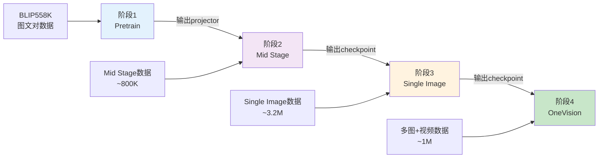
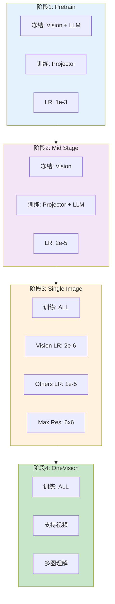

# LLaVA-OneVision 训练流程完整指南

## 📋 训练流程概览

从头训练LLaVA-OneVision需要经历**4个阶段**，而不是3个。让我详细解释：



---

## 🎯 完整训练顺序

### ⚠️ 重要说明

**您提到的三个脚本顺序不完全正确！**

正确的顺序应该是：

```bash
# 正确的4阶段顺序
1. pretrain_siglip.sh       # ✅ 预训练projector
2. [缺失] mid_stage.sh      # ⚠️ 中间阶段（脚本缺失）
3. finetune_si.sh          # ✅ 单图微调
4. finetune_ov.sh          # ✅ OneVision微调
```

**问题**：
- `finetune_si.sh` 中的 `PREV_STAGE_CHECKPOINT` 应该指向 **mid stage** 的输出，而不是 pretrain 的输出
- 项目中缺少独立的 `mid_stage.sh` 脚本

---

## 📊 各阶段详细说明

### 阶段1: Pretrain（预训练）

**脚本**: `scripts/train/pretrain_siglip.sh`

**目的**: 学习视觉-语言对齐，训练 MM Projector

**训练配置**:
```bash
数据: BLIP558K (~558K 图文对)
训练模块: mm_mlp_adapter (仅projector)
冻结模块: Vision Tower + Language Model
学习率: 1e-3 (较高)
Epoch: 1
批次大小: 16
```

**输出**:
```
checkpoints/projectors/llavanext-{vision}-{llm}-mlp2x_gelu-pretrain/
└── mm_projector.bin  # 这是关键输出文件
```

**关键参数分析**:
```bash
--mm_tunable_parts="mm_mlp_adapter"  # 只训练projector
--learning_rate 1e-3                 # 高学习率
--num_train_epochs 1                 # 快速对齐
```

---

### 阶段2: Mid Stage（中间阶段）⚠️

**脚本**: `[缺失，需要自己创建]`

**目的**: 在高质量数据上联合训练 Projector + LLM

**训练配置**:
```bash
数据: mid_stage.yaml (~800K)
  - BLIP558K (with prompts)
  - COCO118K (with prompts)  
  - CC3M Recap
  - UReader
  - SynthDog (中英文)
  - Evol-Instruct-GPT4-Turbo

训练模块: mm_mlp_adapter + mm_language_model
冻结模块: Vision Tower (仍冻结)
学习率: 2e-5
Epoch: 1
```

**输出**:
```
checkpoints/onevision/llava-onevision-{vision}-{llm}-mid_stage/
├── pytorch_model.bin
├── config.json
└── ...
```

**为什么需要这个阶段？**
1. 在Pretrain中只训练了projector，LLM还是原始的
2. 需要让LLM适应视觉token，学习多模态理解
3. 使用相对干净、高质量的数据集进行初步微调

---

### 阶段3: Single Image Stage（单图阶段）

**脚本**: `scripts/train/finetune_si.sh`

**目的**: 在大规模单图数据上全面提升能力

**训练配置**:
```bash
数据: single_image.yaml (~3.2M)
  包括:
  - LLaVA-NeXT 790K
  - 数学推理数据 (GeoQA, MathV360K)
  - OCR数据 (TextOCR, UReader)
  - 图表理解 (ChartQA, PlotQA)
  - 通用VQA (VQAv2, GQA)
  - ShareGPT4V系列
  - Cauldron系列
  - ... 等等

训练模块: mm_vision_tower + mm_mlp_adapter + mm_language_model (全训练)
学习率: 1e-5 (vision: 2e-6)
Epoch: 1
```

**关键变化**:
```bash
# 现在解冻Vision Tower！
--mm_tunable_parts="mm_vision_tower,mm_mlp_adapter,mm_language_model"
--mm_vision_tower_lr=2e-6  # 视觉编码器用更小的学习率

# 支持更高分辨率
--image_aspect_ratio anyres_max_9
--image_grid_pinpoints "(1x1),...,(6x6)"  # 最大支持6x6网格

# 更长的上下文
--model_max_length 32768
```

**输出**:
```
checkpoints/onevision/llava-onevision-{vision}-{llm}-si_stage/
```

---

### 阶段4: OneVision Stage（多模态阶段）

**脚本**: `scripts/train/finetune_ov.sh`

**目的**: 学习多图和视频理解能力

**训练配置**:
```bash
数据: onevision.yaml (~1M)
  - 单图数据replay (~800K，从阶段3采样)
  - 多图数据 (M4-Instruct: DEMON + Mantis)
  - 视频数据 (LLaVA-Video-178K 子集)

训练模块: mm_vision_tower + mm_mlp_adapter + mm_language_model
学习率: 1e-5 (vision: 2e-6)
Epoch: 1
```

**关键特性**:
```bash
--frames_upbound 32  # 支持最多32帧视频
# 数据包含多种模态：单图、多图、视频
```

**输出**:
```
checkpoints/onevision/llava-onevision-{vision}-{llm}-ov_stage/
# 这就是最终的 LLaVA-OneVision 模型！
```

---

## 🔧 创建缺失的 Mid Stage 脚本

由于项目中缺少 `mid_stage.sh`，我为您创建一个：

```bash
# scripts/train/mid_stage.sh

export OMP_NUM_THREADS=8
export NCCL_IB_DISABLE=0
export NCCL_IB_GID_INDEX=3
export NCCL_SOCKET_IFNAME=eth0
export NCCL_DEBUG=INFO

LLM_VERSION="Qwen/Qwen2-7B-Instruct"
LLM_VERSION_CLEAN="${LLM_VERSION//\//_}"
VISION_MODEL_VERSION="google/siglip-so400m-patch14-384"
VISION_MODEL_VERSION_CLEAN="${VISION_MODEL_VERSION//\//_}"

############### Mid Stage ################

PROMPT_VERSION="qwen_1_5"
BASE_RUN_NAME="llavanext-${VISION_MODEL_VERSION_CLEAN}-${LLM_VERSION_CLEAN}-mlp2x_gelu-pretrain_blip558k_plain"
PRETRAIN_PROJECTOR="checkpoints/projectors/${BASE_RUN_NAME}/mm_projector.bin"

RUN_NAME="llava-onevision-${VISION_MODEL_VERSION_CLEAN}-${LLM_VERSION_CLEAN}-mid_stage"
echo "RUN_NAME: ${RUN_NAME}"
echo "Loading pretrained projector from: ${PRETRAIN_PROJECTOR}"

ACCELERATE_CPU_AFFINITY=1 torchrun --nproc_per_node="${NUM_GPUS}" --nnodes="${NNODES}" --node_rank="${RANK}" --master_addr="${ADDR}" --master_port="${PORT}" \
    llava/train/train_mem.py \
    --deepspeed scripts/zero3.json \
    --model_name_or_path ${LLM_VERSION} \
    --version ${PROMPT_VERSION} \
    --data_path scripts/train/mid_stage.yaml \
    --image_folder /path/to/your/image_folder \
    --pretrain_mm_mlp_adapter ${PRETRAIN_PROJECTOR} \
    --mm_tunable_parts="mm_mlp_adapter,mm_language_model" \
    --vision_tower ${VISION_MODEL_VERSION} \
    --mm_projector_type mlp2x_gelu \
    --mm_vision_select_layer -2 \
    --mm_use_im_start_end False \
    --mm_use_im_patch_token False \
    --group_by_modality_length True \
    --image_aspect_ratio anyres \
    --image_grid_pinpoints "(1x1),...,(3x3)" \
    --mm_patch_merge_type spatial_unpad \
    --bf16 True \
    --run_name ${RUN_NAME} \
    --output_dir checkpoints/onevision/${RUN_NAME} \
    --num_train_epochs 1 \
    --per_device_train_batch_size 4 \
    --per_device_eval_batch_size 4 \
    --gradient_accumulation_steps 4 \
    --evaluation_strategy "no" \
    --save_strategy "steps" \
    --save_steps 1000 \
    --save_total_limit 2 \
    --learning_rate 2e-5 \
    --weight_decay 0. \
    --warmup_ratio 0.03 \
    --lr_scheduler_type "cosine" \
    --logging_steps 1 \
    --tf32 True \
    --model_max_length 4096 \
    --gradient_checkpointing True \
    --dataloader_num_workers 4 \
    --lazy_preprocess True \
    --report_to wandb \
    --attn_implementation flash_attention_2
```

---

## ✅ 完整执行顺序

### 方案A: 完整4阶段训练（推荐）

```bash
# 1. 预训练 Projector
bash scripts/train/pretrain_siglip.sh

# 2. Mid Stage（需要先创建脚本）
bash scripts/train/mid_stage.sh

# 3. Single Image 微调
# 修改 finetune_si.sh 中的 PREV_STAGE_CHECKPOINT 指向 mid_stage 的输出
bash scripts/train/finetune_si.sh

# 4. OneVision 微调
# 修改 finetune_ov.sh 中的 PREV_STAGE_CHECKPOINT 指向 si_stage 的输出
bash scripts/train/finetune_ov.sh
```

### 方案B: 跳过Mid Stage（快速实验）

**如果想快速实验或资源有限**，可以考虑跳过 Mid Stage：

```bash
# 1. 预训练
bash scripts/train/pretrain_siglip.sh

# 2. 直接进入 Single Image（需要修改脚本）
# 修改 finetune_si.sh:
#   - 删除 PREV_STAGE_CHECKPOINT 行
#   - 改用 --model_name_or_path ${LLM_VERSION}
#   - 添加 --pretrain_mm_mlp_adapter 指向 pretrain 输出的 mm_projector.bin
bash scripts/train/finetune_si.sh  # (修改后)

# 3. OneVision
bash scripts/train/finetune_ov.sh
```

**方案B的修改示例**:
```bash
# 修改 finetune_si.sh 中的这部分：

# 原来：
PREV_STAGE_CHECKPOINT="/path/to/mid_stage/checkpoint"
--model_name_or_path $PREV_STAGE_CHECKPOINT \

# 改为：
PRETRAIN_PROJECTOR="checkpoints/projectors/.../mm_projector.bin"
--model_name_or_path ${LLM_VERSION} \
--pretrain_mm_mlp_adapter ${PRETRAIN_PROJECTOR} \
```

---

## 📊 各阶段对比表

| 阶段 | 训练模块 | 数据规模 | 学习率 | 主要目的 |
|------|---------|---------|--------|---------|
| **Pretrain** | Projector | 558K | 1e-3 | 视觉-语言对齐 |
| **Mid Stage** | Projector + LLM | ~800K | 2e-5 | 初步多模态理解 |
| **Single Image** | Vision + Projector + LLM | ~3.2M | 1e-5 | 全面单图能力 |
| **OneVision** | Vision + Projector + LLM | ~1M | 1e-5 | 多图+视频能力 |

---

## 🔍 关键参数变化追踪



---

## ⚠️ 常见错误和解决方案

### 错误1: 直接从Pretrain跳到Single Image

**症状**:
```
RuntimeError: Error(s) in loading state_dict for LlavaQwenForCausalLM
```

**原因**: `finetune_si.sh` 期望加载完整的model checkpoint，但pretrain只输出了projector

**解决**: 要么添加Mid Stage，要么修改脚本使用 `--pretrain_mm_mlp_adapter`

### 错误2: Checkpoint路径错误

**症状**:
```
OSError: /mnt/bn/vl-research/checkpoints/... does not exist
```

**原因**: 脚本中的路径是作者的内部路径

**解决**: 修改所有 `PREV_STAGE_CHECKPOINT` 为您自己的路径

### 错误3: 数据路径不匹配

**症状**:
```
FileNotFoundError: data_path not found
```

**解决**: 
```bash
# 修改yaml文件中的所有路径
# 或者创建软链接：
ln -s /your/data/path /mnt/bn/vl-research/data
```

---

## 💾 资源需求估算

### 单机8卡 A100 80GB 配置

| 阶段 | 显存/卡 | 批次 | 训练时间 | 磁盘空间 |
|------|--------|------|---------|---------|
| Pretrain | ~40GB | 16 | ~8小时 | 5GB |
| Mid Stage | ~60GB | 4 | ~24小时 | 20GB |
| Single Image | ~70GB | 1-2 | ~5天 | 30GB |
| OneVision | ~70GB | 1-2 | ~2天 | 30GB |

### 优化建议

**显存不足时**:
```bash
# 1. 使用ZeRO-3 Offload
--deepspeed scripts/zero3_offload.json

# 2. 减小批次
--per_device_train_batch_size 1
--gradient_accumulation_steps 16

# 3. 降低分辨率
--image_grid_pinpoints "(1x1),(2x2)"  # 而不是6x6
```

---

## 📝 训练清单

使用此清单确保训练顺利：

- [ ] **准备数据**
  - [ ] 下载BLIP558K
  - [ ] 下载Mid Stage数据
  - [ ] 下载Single Image数据
  - [ ] 下载MultiImage + Video数据
  
- [ ] **配置环境**
  - [ ] 安装依赖 `pip install -e ".[train]"`
  - [ ] 配置DeepSpeed
  - [ ] 测试多卡通信 `nvidia-smi`
  
- [ ] **修改脚本**
  - [ ] 创建 `mid_stage.sh`
  - [ ] 修改所有数据路径
  - [ ] 修改输出checkpoint路径
  - [ ] 配置WandB (可选)
  
- [ ] **执行训练**
  - [ ] ✅ Stage 1: Pretrain
  - [ ] ✅ Stage 2: Mid Stage
  - [ ] ✅ Stage 3: Single Image
  - [ ] ✅ Stage 4: OneVision
  
- [ ] **验证模型**
  - [ ] 推理测试
  - [ ] 评估基准测试
  - [ ] 保存最终模型

---

## 🎓 总结

**您的原问题答案**:

❌ **不应该直接**: `pretrain_siglip.sh → finetune_si.sh → finetune_ov.sh`

✅ **应该是**: 
```
pretrain_siglip.sh 
→ mid_stage.sh (需要创建) 
→ finetune_si.sh (修改checkpoint路径) 
→ finetune_ov.sh
```

或者跳过Mid Stage但需要修改脚本。

**关键要点**:
1. 项目缺少独立的 `mid_stage.sh` 脚本
2. `finetune_si.sh` 需要完整checkpoint作为输入，不是projector
3. 每个阶段都有明确的目的和训练策略
4. 不要跳过阶段，除非你知道如何正确修改脚本

---

**需要帮助？**
- 查看 `scripts/train/README.md`
- 参考 `PROJECT_DOCUMENTATION.md`
- 加入Discord社区

**祝训练顺利！🚀**
